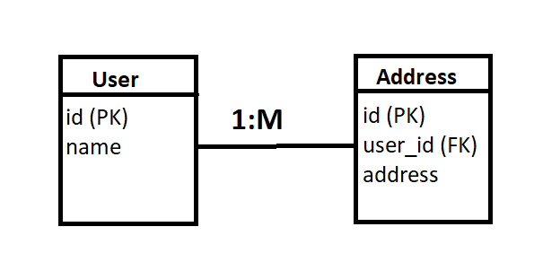

# User Registration and Address Storage

## Overview
This project is a web application that allows users to register with their names and store their addresses. It uses React for the frontend, Node.js with Express for the backend, and MySQL as the database.

## Technologies Used
- **Frontend**: React, SCSS
- **Backend**: Node.js, Express
- **Database**: MySQL
- **Middleware**: CORS, body-parser

## ER Diagram

## 
## Features
- User registration form to capture name and address.
- Data stored in a relational database with one-to-many relationships between users and addresses.

## Installation

### Prerequisites
- Node.js (v14 or later)
- MySQL Server
- npm or yarn
